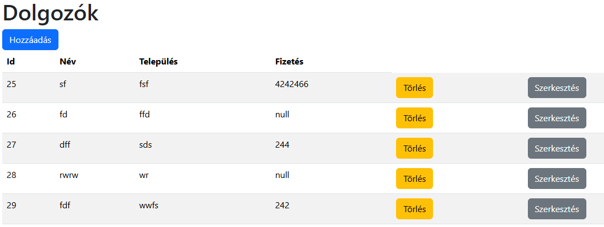
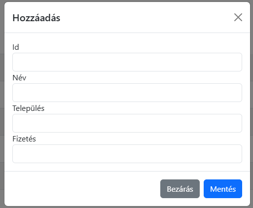
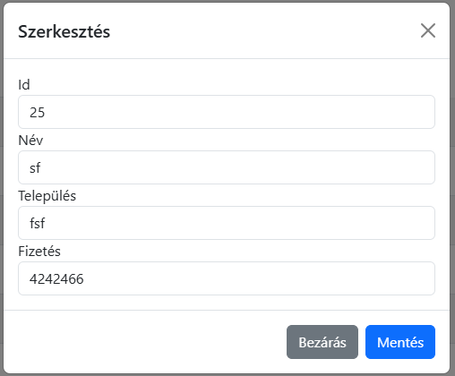

# Felhasználói dokumentáció

## Telepítés

Lépések:
* Letöltés
* Függőségek telepítése
* Backend indítása
* Frontend indítása

### Letöltés

Töltsük le a következő helyről:

* https://github.com/barthaleventegabor/empke.git

Például:

```bash
git clone https://github.com/barthaleventegabor/empke.git
```

### Függőségek telepítése és indítás

Backend:

```bash
cd api
npm install
npm start
```

Frontend:

```bash
cd web
npm install
npm start
```

## Dolgozók kezelése:

A főoldalon a dolgozók listáját látjuk.



Új dolgozó felvétele a táblázat felett a "hozzáadás"
gombra kattintva leehtséges.



A törlés a "Törlés" feliratú gombra kattintva kivitelezhető.

Egy dolgozó szerkesztése a "Szerkesztés" gombra kattintva 
kezdeményezhető, az adott sorban.


